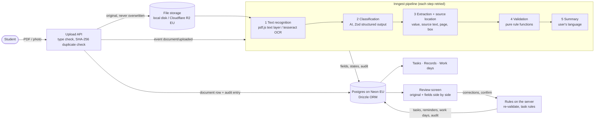

# Paperwork

Paperwork helps students in Germany keep up with official letters. Upload a letter as a PDF or a photo; Paperwork reads it, proposes what matters (who sent it, how much, by when, what to do), lets you check every value against the original, and turns confirmed documents into tasks with reminders. For non-EU students it also tracks the yearly work-day limit (140 full or 280 half days) from payslips.

## The problem

Letters from health insurers, the foreigners' office, landlords, utilities, universities and employers arrive in formal German. Missing one can mean a late fee, a lapsed residence permit or exceeding the work limit tied to a student visa. The information is there, but it is spread over dense paper, deadlines are easy to misread, and nobody keeps the overview for you.

## What it does

- **Inbox:** drop in a PDF or photo. Duplicates are recognized by their content hash.
- **Processing:** text recognition (PDF text layer or OCR for photos and scans), classification into a fixed document type, field extraction, and validation, each as a retried background step with live status.
- **Review:** the original on the left, the extracted fields on the right. Hovering a field highlights where it was read in the document. Every field shows whether it is valid, needs a check or is missing, and why.
- **Tasks:** confirming a document creates tasks by fixed rules (pay an invoice, attend and prepare an appointment, respond to a decision) with reminders before the deadline.
- **Records:** confirmed documents with the original, the confirmed values and what was created from them.
- **Work days:** full and half days per month from confirmed payslips, the remaining days of the yearly limit, and warnings at 80 % and 100 %.
- **Settings:** reminder schedule, history retention, a filterable history log, and deleting documents or the whole account.
- German and English, light and dark mode.

## The principle

> **AI proposes → rules validate → user confirms → system acts.**

- The model only _proposes_ values, each with the exact text it was read from.
- Deterministic, unit-tested rules _validate_ them: dates, amounts, IBAN checksums, reference formats, deadlines after the letter date, required fields, and whether the value can actually be found in the document.
- Nothing is created or sent until the user _confirms_. Corrections and confirmations are re-checked on the server.
- Only then does the system _act_: tasks, reminders and work-day entries come from fixed rules, never from the model. The Review screen shows exactly what confirming will create, computed by the same function.
- Originals are stored unchanged, and every change is written to an audit log (actor: system, ai or user). Deleting a document removes its content from the log as well.

## Architecture



- **AI provider** is isolated in `src/server/ai`: `AI_PROVIDER=google|anthropic|mock`. The pipeline never imports a provider.
- **Pure logic** (validation, source matching, task rules, work-day calculation, deletion plans) lives in `src/lib` and is unit-tested without a database.
- **Server code** (database, auth, storage, pipeline, queries, server actions) lives in `src/server`.

## Tech choices

| Area             | Choice                                                            | Why                                                                                                 |
| ---------------- | ----------------------------------------------------------------- | --------------------------------------------------------------------------------------------------- |
| Framework        | Next.js App Router, React, TypeScript (strict)                    | Server components and server actions keep data access on the server with one language end to end.   |
| UI               | Tailwind CSS, shadcn/ui (Radix), Geist                            | Accessible primitives we own as code, styled to a minimal design with tokens for light and dark.    |
| i18n             | next-intl                                                         | German and English with German date and number formats; locale in a cookie, no locale in URLs.      |
| Database         | Postgres on Neon (EU)                                             | Serverless Postgres with an HTTP driver that fits serverless functions, hosted in the EU.           |
| ORM              | Drizzle                                                           | Typed SQL close to the database, plain SQL migrations in the repo.                                  |
| Auth             | Better Auth                                                       | Email and password with sessions in our own database, no external identity provider.                |
| Files            | Cloudflare R2 (EU jurisdiction), local disk in development        | S3-compatible, no egress fees, data stays in the EU; the driver is chosen by one variable.          |
| Background jobs  | Inngest                                                           | Durable steps with retries and backoff, a local dev server without an account, cron for daily jobs. |
| Text recognition | pdf.js, tesseract.js (deu + eng), @napi-rs/canvas                 | Word positions from PDF text layers; OCR with positions for photos and scanned PDFs, all in Node.   |
| AI               | Vercel AI SDK with Zod structured output; Gemini Flash by default | Typed, schema-checked results and a provider that can be switched without touching the pipeline.    |
| Tests            | Vitest                                                            | Fast unit tests for every rule, plus a pipeline test over sample letters with the mock AI provider. |
| CI               | GitHub Actions                                                    | Lint, format, typecheck, tests and build on every push, without secrets.                            |

Planned: React Email + Postmark for reminder emails, Sentry, Playwright end-to-end tests.

## Run it locally

Requirements: Node.js 22+, pnpm, a Neon Postgres database. An AI key is optional.

```bash
pnpm install
cp .env.example .env.local
```

Fill in `.env.local`:

- `DATABASE_URL`: your Neon connection string.
- `BETTER_AUTH_SECRET`: generate with `node -e "console.log(require('crypto').randomBytes(32).toString('base64url'))"`.
- AI: either `GOOGLE_GENERATIVE_AI_API_KEY` (Google AI Studio), or `AI_PROVIDER=mock` to work without any key.
- Keep `INNGEST_DEV=1` and `STORAGE_DRIVER=local`.

Then:

```bash
pnpm db:migrate   # create the tables
pnpm dev:all      # Next.js on :3000 and the Inngest dev server on :8288
```

Open http://localhost:3000, create an account and upload a letter from `fixtures/letters/`. The Inngest dashboard at http://localhost:8288 shows each pipeline run with its steps, retries and errors.

- `pnpm dev` and `pnpm inngest:dev` can also run in two terminals. If the Inngest dev server is not running, uploads show "Processing service not running, start it with pnpm dev:all"; start it and press Retry.
- Demo data: `pnpm db:seed --email you@example.com` fills an account with fictional documents, tasks (one overdue), records and work days. It creates the user if needed and replaces that user's data when run again.
- OCR language data (~15 MB) is downloaded on first use into `.data/tesseract`; uploads are stored in `.data/uploads`. Both are git-ignored.

**AI providers:** `google` (default, `gemini-flash-latest`), `anthropic` (`claude-opus-5-5`) or `mock`. `AI_MODEL` overrides the model. The Gemini free tier may use inputs to improve Google's models and has a small daily limit per model (20 requests at the time of writing; each document needs three), so use only fictional documents with it. When the limit is reached, documents fail with "daily AI limit reached" and can be retried later.

## Test

```bash
pnpm lint
pnpm format:check
pnpm typecheck
pnpm test        # Vitest, uses AI_PROVIDER=mock: no API key or database needed
pnpm build
```

- Unit tests cover every validation rule, source-text matching, task rules, the work-day calculation, review logic, deletion plans, formatting and file-type detection.
- `src/server/pipeline/letters.test.ts` runs the seven fictional letters in `fixtures/letters/` through real text recognition (including OCR), the mock AI provider, source location, validation and task rules, and checks them against `fixtures/letters/EXPECTED_RESULTS.md`.
- CI (`.github/workflows/ci.yml`) runs the same commands on every push with placeholder environment values.

## Scripts

| Script                                                    | Purpose                                     |
| --------------------------------------------------------- | ------------------------------------------- |
| `pnpm dev:all`                                            | Next.js and the Inngest dev server together |
| `pnpm dev`                                                | Next.js dev server only                     |
| `pnpm inngest:dev`                                        | Inngest dev server for `pnpm dev`           |
| `pnpm build` / `pnpm start`                               | Production build and server                 |
| `pnpm lint` / `pnpm format` / `pnpm format:check`         | ESLint and Prettier                         |
| `pnpm typecheck`                                          | Route types and `tsc`                       |
| `pnpm test` / `pnpm test:watch`                           | Vitest                                      |
| `pnpm db:generate` / `pnpm db:migrate` / `pnpm db:studio` | Drizzle migrations and studio               |
| `pnpm db:seed`                                            | Demo data for a user                        |

## Project structure

```
docs/design/        Design mockup
drizzle/            SQL migrations
fixtures/letters/   Fictional sample letters and their expected results
messages/           UI strings (de.json, en.json)
src/app/            Routes: (app) pages, (auth) sign-in/up, api (auth, upload, files, Inngest)
src/components/     UI: shell, data tables, review, documents, settings, ui (shadcn)
src/lib/            Pure, unit-tested logic: validation, matching, task rules, work days, formatting
src/server/         Server only: db, auth, storage, ai, pipeline, inngest, queries, actions
src/proxy.ts        Redirects page requests without a session cookie to sign-in
```

Deployment: see [DEPLOYMENT.md](DEPLOYMENT.md). Architecture, design rules and conventions: [docs/CONVENTIONS.md](docs/CONVENTIONS.md).
